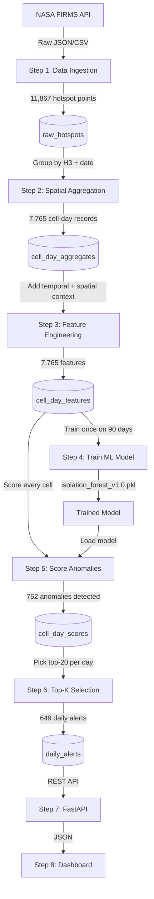

# 🔥 Wildfire Hotspot Anomaly Detection System - Complete Flow

## Overview

This system detects **anomalous wildfire activity** in Indonesia using:
1. NASA FIRMS satellite data (raw hotspot points)
2. H3 spatial aggregation (hexagonal grid grouping)
3. Feature engineering (temporal + spatial context)
4. Isolation Forest ML (unsupervised anomaly detection)
5. Top-K selection with spatial coherence validation
6. REST API + Dashboard

> [!IMPORTANT]
> **Key Concept:** ML operates at **H3 cell × day** level, NOT individual hotspot points.
> "This hex area is anomalous today" not "this GPS point is anomalous."

---

## Complete Pipeline Architecture



---

## Step 1: Data Ingestion

### What Happens
NASA FIRMS provides satellite hotspot data as JSON/CSV. Each record = one fire detection point.

### Raw Hotspot Data (per record)
```
latitude:    -0.512          → GPS coordinate
longitude:   109.312         → GPS coordinate
frp:         42.1            → Fire Radiative Power (MW) — fire intensity
confidence:  'h'/'n'/'l'     → high/nominal/low detection confidence
brightness:  327.4           → Brightness temperature (Kelvin)
acq_date:    2025-11-05      → Acquisition date
acq_time:    1345            → Acquisition time (UTC)
satellite:   'N'             → Suomi NPP satellite
instrument:  'VIIRS'         → Sensor used
daynight:    'D'             → Day or Night detection
```

### Script: `scripts/import_archive.py`
```python
# For each hotspot record:
# 1. Parse acquisition date + time
acq_datetime = datetime(2025, 11, 5, 13, 45)

# 2. Convert lat/lng to H3 hexagonal cell index (resolution 7)
h3_index = h3.latlng_to_cell(latitude, longitude, 7)
# → "871f2b4a5ffffff"

# 3. Insert into raw_hotspots table
```

### Result
- **11,867 raw hotspot records** inserted into `raw_hotspots` table
- Date range: 2025-11-01 to 2026-01-31 (92 days)

---

## Step 2: Spatial Aggregation (H3 Grid)

### Why We Need This

**Problem:** 11,867 individual points = too granular, no spatial structure.

**Solution:** Group nearby points into H3 hexagonal cells.

### What is H3?

H3 is a hexagonal grid system that divides the entire globe into hexagons. Each hexagon has a unique ID called an **H3 index**.

```
Indonesia from above (H3 resolution 7):

    ⬡  ⬡  ⬡  ⬡  ⬡  ⬡   ← Kalimantan
  ⬡  ⬡  ⬡  ⬡  ⬡  ⬡  ⬡
    ⬡  ⬡  ⬡  ⬡  ⬡  ⬡   ← Sumatra
  ⬡  ⬡  ⬡  ⬡  ⬡  ⬡  ⬡
    ⬡  ⬡  ⬡  ⬡  ⬡  ⬡   ← Jawa/Papua

Each ⬡ = 1 H3 cell = ~23 km² area
```

**Why resolution 7?**
- Edge length: ~5.2 km
- Area: ~23 km² per cell
- Large enough to aggregate multiple hotspots
- Small enough for spatial precision

**How it works:**
```python
# Three nearby hotspot points → same H3 cell
Point 1: lat=-0.500, lng=109.300  → h3_index = "871f2b4a5ffffff"
Point 2: lat=-0.501, lng=109.301  → h3_index = "871f2b4a5ffffff"  ← same!
Point 3: lat=-0.499, lng=109.299  → h3_index = "871f2b4a5ffffff"  ← same!
```

### What Aggregation Calculates

For each H3 cell on each date, we calculate:

```
Cell "871f2b4a5ffffff" on 2025-11-05:
  hotspot_count:            3       ← total hotspots in cell
  total_frp:               15.8 MW  ← sum of fire intensity
  max_frp:                  7.5 MW  ← peak fire intensity
  avg_frp:                  5.3 MW  ← mean fire intensity
  high_confidence_count:    2       ← high confidence detections
  nominal_confidence_count: 1       ← nominal confidence detections
  low_confidence_count:     0       ← low confidence detections
```

### Script: `scripts/aggregate_daily.py`
```bash
# Initial setup (all historical data)
python scripts/aggregate_daily.py

# Daily production (new data only)
python scripts/aggregate_daily.py --date 2026-02-17
```

### Result
- 11,867 points → **7,765 cell-day records**
- 5,143 unique H3 cells
- 92 unique dates

---

## Step 3: Feature Engineering (Temporal + Spatial Context)

### Why We Need This

**Problem:** Raw aggregates alone don't tell ML if 47 hotspots is normal or unusual.

```
Cell "871f2b4a5ffffff" on 2025-11-05:
  hotspot_count: 47

ML asks: "Is 47 a lot? Normal? I don't know."  ❌
```

**Solution:** Add context — compare to the past and surrounding cells.

### Temporal Context (Time-Based)

Temporal = related to **time**. We compare today's data to historical patterns.

#### Feature 1: `delta_count_vs_prev_day`
**"How much did hotspot count change compared to yesterday?"**

```python
delta = today.hotspot_count - yesterday.hotspot_count

# Example:
# Yesterday: 8 hotspots
# Today:    47 hotspots
# Delta:    +39  ← drastic spike!
```

This catches **sudden increases** that could indicate a new fire event.

#### Feature 2: `ratio_vs_7d_avg`
**"How does today compare to the 7-day average?"**

```python
avg_7d = average(hotspot_count for last 7 days)
ratio  = today.hotspot_count / avg_7d

# Example:
# Last 7 days average: 12 hotspots
# Today:               47 hotspots
# Ratio:               3.92x  ← almost 4x above normal!
```

This catches **sustained elevation** above baseline, even if yesterday was also high.

### Spatial Context (Location-Based)

Spatial = related to **surrounding area**. We check if neighboring cells are also active.

#### Feature 3: `neighbor_activity`
**"How many of the 6 neighboring hexagons are also active?"**

Each H3 cell has exactly 6 direct neighbors (hexagons touch on all 6 sides):

```
      ⬡
   ⬡  ⬡  ⬡
      ⬡
   ⬡ [A] ⬡   ← Cell A in the center
      ⬡
   ⬡  ⬡  ⬡
      ⬡

Cell A has 6 neighbors (touching hexagons)
```

```python
neighbors = h3.grid_ring(h3_index, 1)  # Get 6 neighbors
neighbor_activity = count(cells in neighbors where hotspot_count > 0)

# Example:
# North neighbor:     23 hotspots ← active
# Northeast neighbor: 15 hotspots ← active
# Southeast neighbor: 31 hotspots ← active
# South neighbor:     19 hotspots ← active
# Southwest neighbor: 12 hotspots ← active
# Northwest neighbor: 27 hotspots ← active
# neighbor_activity = 6  ← ALL neighbors active → fire spreading!
```

Real wildfires **spread geographically** → anomalies should cluster.
- `neighbor_activity = 6` → Likely real wildfire event
- `neighbor_activity = 0` → Isolated point, possibly false positive

### Before vs After Feature Engineering

```
BEFORE (cell_day_aggregates) — ML is blind:
  Cell "871f2b4a5ffffff" on 2025-11-05:
    hotspot_count: 47
    total_frp:     156 MW

  ML: "Is 47 a lot? No idea." ❌

AFTER (cell_day_features) — ML has context:
  Cell "871f2b4a5ffffff" on 2025-11-05:
    hotspot_count:            47
    total_frp:               156 MW
    delta_count_vs_prev_day: +39    ← yesterday was only 8!
    ratio_vs_7d_avg:          3.92x  ← 4x above normal!
    neighbor_activity:        6      ← all 6 neighbors active!

  ML: "This is 4x above average, huge spike, all neighbors active → ANOMALY!" ✅
```

### Script: `scripts/build_features.py`
```bash
# Initial setup
python scripts/build_features.py

# Daily production
python scripts/build_features.py --date 2026-02-17
```

### Result
- 7,765 cell-day records with full feature context

---

## Step 4: Train ML Model (Isolation Forest)

### What is Isolation Forest?

An **unsupervised ML algorithm** — no labeled training data needed. It learns what "normal" looks like, then flags anything that deviates.

> [!NOTE]
> Unsupervised = the model is NEVER told "this is definitely a wildfire."
> It only learns the statistical distribution of 90 days of activity and flags outliers.

### Core Concept: "How Hard Is It to Isolate This Point?"

Imagine 100 cell-day records plotted in 2D (hotspot_count vs ratio_vs_7d_avg):

```
ratio_vs_7d_avg
     │
 4x  │                              ★  ← Anomaly
     │                         (hotspot=47, ratio=3.92x)
 2x  │
     │
 1x  │  ●●●●●●●●●●●●●●●●●●●●●●●
     │  ●●●●●●●●●●●●●●●●●●●●●●●
0.5x │  ●●●●●●●●●●●●●●●●●●●●●●●
     └──────────────────────────────
        0    5   10   15   20
                   hotspot_count

● = Normal cells (tightly clustered)
★ = Anomaly (far from cluster)
```

The algorithm asks: **"How many random cuts does it take to isolate this point?"**

**Normal cell (deep in the cluster):**
```
Cut 1: hotspot > 10?   → Still 40 cells left
Cut 2: hotspot > 7?    → Still 20 cells left
Cut 3: ratio > 1.2x?   → Still 10 cells left
Cut 4: hotspot > 5?    → Still 5 cells left
Cut 5: ratio > 0.9x?   → Finally isolated!

→ 5 cuts needed → Score: +0.15 (NORMAL ✅)
```

**Anomalous cell (far from cluster):**
```
Cut 1: hotspot > 30?   → Only anomaly left!

→ 1 cut needed → Score: -0.45 (ANOMALY 🚨)
```

**Why fewer cuts = more anomalous?**
Because anomalies stand far from the crowd — one random split immediately separates them. Normal points are surrounded by similar points and take many splits to isolate.

### Score Interpretation

```
Model score from decision_function():

+0.5  ──── Very normal (stable, predictable area)
+0.2  ──── Normal
 0.0  ──── Borderline
-0.2  ──── Slightly anomalous
-0.4  ──── Anomalous 🚨
-0.6  ──── Very anomalous 🔥🔥
```

### The `contamination` Parameter

```python
IsolationForest(contamination=0.1)
# contamination=0.1 means:
# "We expect ~10% of data to be anomalous"
# Model sets threshold so exactly 10% get flagged
```

### Script: `scripts/train_model.py`

```python
model = IsolationForest(
    contamination=0.1,   # Expect 10% anomalies
    n_estimators=100,    # Build 100 random trees
    random_state=42,     # Reproducible results
    n_jobs=-1            # Use all CPU cores
)
model.fit(X_scaled)
joblib.dump(model, 'models/isolation_forest_v1.0.pkl')
```

**Model Features Used:**
| Feature | Description |
|---------|-------------|
| `hotspot_count` | Number of hotspots in cell |
| `total_frp` | Total fire intensity (MW) |
| `max_frp` | Peak fire intensity (MW) |
| `delta_count_vs_prev_day` | Change from yesterday |
| `ratio_vs_7d_avg` | Ratio compared to 7-day average |
| `neighbor_activity` | Count of active neighboring cells |

```bash
python scripts/train_model.py
# Trains on last 90 days, saves to models/isolation_forest_v1.0.pkl
```

**Training Stats:**
- Training samples: 5,291 cell-days
- Training time: ~30 seconds
- Hardware: CPU only, no GPU needed
- Retraining frequency: Monthly (to adapt to seasonal patterns)

---

## Step 5: Score Anomalies

Apply the trained model to every cell-day record.

### Script: `scripts/score_daily.py`

```python
# Load model
model_package = joblib.load('models/isolation_forest_v1.0.pkl')
model = model_package['model']
scaler = model_package['scaler']

# Scale features (same way as training)
X_scaled = scaler.transform(features)

# Score: lower = more anomalous
scores = model.decision_function(X_scaled)
# e.g. [-0.45, +0.12, +0.31, -0.18, ...]

# Flag if below threshold
is_anomaly = model.predict(X_scaled) == -1
# -1 = anomaly, +1 = normal
```

```bash
# Score all historical data
python scripts/score_daily.py

# Score specific date (production)
python scripts/score_daily.py --date 2026-02-17
```

### Concrete Example

```
Cell A: hotspot=47, ratio=3.92x, neighbors=6
  → Score: -0.45  → is_anomaly: True  🚨

Cell B: hotspot=12, ratio=1.05x, neighbors=2
  → Score: +0.18  → is_anomaly: False ✅

Cell C: hotspot=3, ratio=0.80x, neighbors=0
  → Score: +0.32  → is_anomaly: False ✅
```

### Result
- 7,765 scores saved to `cell_day_scores`
- **752 anomalies detected** (9.7% ≈ contamination=10%)

---

## Step 6: Top-K Selection with Spatial Coherence

### Why Not Just Use Raw Anomaly Scores?

The ML score only reflects statistical deviation. But real wildfires **spread geographically**. An isolated anomaly (no active neighbors) is more likely a false positive than a cluster of anomalous cells.

### Spatial Coherence Validation

For each anomalous cell, we check:

```python
neighbors = h3.grid_ring(h3_index, 1)  # 6 neighboring cells

active_neighbors    = count(neighbors with hotspot_count > 0)
anomalous_neighbors = count(neighbors flagged as is_anomaly = True)
```

**Coherence Levels:**

| Level | Criteria | Meaning |
|-------|----------|---------|
| 🔴 **High** | 4+ active OR 3+ anomalous neighbors | Fire cluster — high priority |
| 🟠 **Medium** | 2-3 active OR 2 anomalous neighbors | Fire spreading |
| 🟡 **Low** | 1 active OR 1 anomalous neighbor | Possibly spreading |
| ⚪ **Isolated** | 0 active neighbors | Needs manual review |

### Hybrid Score

Combines ML score with spatial coherence:

```python
# ML component (70% weight): how anomalous is this cell?
ml_component = abs(anomaly_score) * 0.7

# Spatial component (30% weight): how coherent is the spatial pattern?
coherence_normalized = coherence_score / 6.0
spatial_component = coherence_normalized * 0.3

hybrid_score = ml_component + spatial_component
```

Higher hybrid score = higher alert priority.

### Example

```
Cell A: anomaly_score=-0.68, neighbors=6 active, 3 anomalous
  → coherence_level = "high"
  → hybrid_score = (0.68 × 0.7) + (1.0 × 0.3) = 0.776  ← TOP PRIORITY 🔴

Cell B: anomaly_score=-0.45, neighbors=1 active, 0 anomalous
  → coherence_level = "low"
  → hybrid_score = (0.45 × 0.7) + (0.16 × 0.3) = 0.363  ← lower priority 🟡

Cell C: anomaly_score=-0.55, neighbors=0 active, 0 anomalous
  → coherence_level = "isolated"
  → needs_manual_review = True
  → hybrid_score = (0.55 × 0.7) + (0.0 × 0.3) = 0.385  ← flagged ⚪
```

### Script: `scripts/select_top_k.py`

```bash
# Select top-20 per day across all dates
python scripts/select_top_k.py

# Specific date + custom K
python scripts/select_top_k.py --date 2026-02-17 --k 20
```

### Result
- **649 total alerts** across 92 days (~7 per day)
- Saved to `daily_alerts` table with rank, hybrid score, and coherence level

---

## Step 7: REST API (FastAPI)

The API serves pre-computed results to the dashboard.

### Key Endpoints

| Endpoint | Description |
|----------|-------------|
| `GET /api/alerts?date=YYYY-MM-DD` | Top-K alerts for a date |
| `GET /api/map?date=YYYY-MM-DD` | All scored cells for map rendering |
| `GET /api/cells/{h3_index}` | Full detail for one cell |
| `GET /api/cells/{h3_index}/timeseries` | 30-day chart data |
| `GET /api/stats` | System overview stats |
| `GET /api/pipeline/status` | Health check |

All endpoints return pre-computed data from the database — no ML computation at request time.

---

## Step 8: Daily Production Pipeline

In production, the full pipeline runs automatically every day at 1 AM:

```
01:00 UTC — Fetch yesterday's FIRMS data (API call)
01:05 UTC — Aggregate new hotspots by H3 cell
01:10 UTC — Build features (temporal + spatial context)
01:15 UTC — Score anomalies with trained model
01:20 UTC — Select top-K alerts with spatial coherence
01:25 UTC — Alerts available via API
```

**Script: `scripts/daily_pipeline.py`**

```bash
# Cron job (runs daily at 1 AM)
0 1 * * * cd /app && python scripts/daily_pipeline.py

# Or manually for a specific date
python scripts/daily_pipeline.py --date 2026-02-17
```

### Model Retraining

Monthly retraining keeps the model current with seasonal patterns:

```python
def should_retrain_model():
    model_data = joblib.load('models/isolation_forest_v1.0.pkl')
    age_days = (datetime.now() - model_data['trained_at']).days
    return age_days > 30  # Retrain if model is >30 days old

if should_retrain_model():
    train_isolation_forest(days_history=90)
```

---

## Database Tables Summary

| Table | Records | Description |
|-------|---------|-------------|
| `raw_hotspots` | 11,867 | Raw satellite detection points |
| `cell_day_aggregates` | 7,765 | Grouped by H3 cell + date |
| `cell_day_features` | 7,765 | With temporal + spatial context |
| `cell_day_scores` | 7,765 | ML anomaly scores per cell-day |
| `daily_alerts` | 649 | Top-K ranked alerts (production use) |

---

## Current System Stats (as of 2026-02-23)

```
Data range:    2025-11-01 to 2026-01-31 (92 days)
Raw hotspots:  11,867
Unique cells:  5,143
ML model:      Isolation Forest v1.0 (trained 2026-02-18)
Training set:  5,291 samples, 90 days
Anomalies:     752 detected (9.7%)
Alerts:        649 total (avg 7/day, top-20 per day)
```

---

## What Makes a "Good" Anomaly?

```
✅ Real wildfire event:
  - hotspot_count: 47  (was 8 yesterday → +39 spike)
  - ratio_vs_7d_avg: 3.92x (4x above normal)
  - neighbor_activity: 6 (all 6 neighbors active)
  - anomaly_score: -0.65 (very anomalous)
  - spatial_coherence: HIGH (fire cluster)
  - hybrid_score: 0.78

⚠️ Possible false positive:
  - hotspot_count: 35  (was 30 yesterday → +5)
  - ratio_vs_7d_avg: 2.1x (2x above normal)
  - neighbor_activity: 0 (no neighbors active)
  - anomaly_score: -0.42 (anomalous)
  - spatial_coherence: ISOLATED
  - needs_manual_review: True

❌ Normal activity:
  - hotspot_count: 12  (stable from 11 yesterday)
  - ratio_vs_7d_avg: 1.02x (basically average)
  - neighbor_activity: 2 (some neighbors, not all)
  - anomaly_score: +0.18 (normal)
  - Not flagged
```
